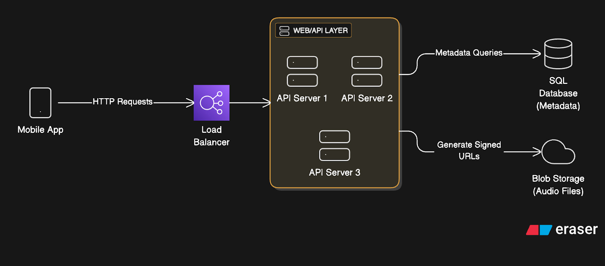

# Spotify System Design 
Resource : https://newsletter.systemdesign.one/p/spotify-system-design

Requirements: https://newsletter.systemdesign.one/i/174962283/requirements-and-assumptions 

Capacity: https://newsletter.systemdesign.one/i/174962283/capacity-planning

 

---

## High Level Architecture 

### Mobile App 
- Generic client side implementation, REST API to fetch meta data 
- Cache recently played songs 
- Client streams audio directly from blob storage or CDN using signed URLs
- TODO: Notes for blob storage and CDN

### Load Balancer 
- Could use round robin or least connections, doesn't particularly matter
- Perform routine health checks 
- In general, helpful for album releases

### API Layer 
-  Stateless servers that handle business logic, auth, data access, etc... 
-  Generate signed URLs for audio access 

### SQL DB 
- Stores metadata 

### Blob Storage 
- See more at [BlobStorage.md](../BlobStorage/BlobStorage.md)